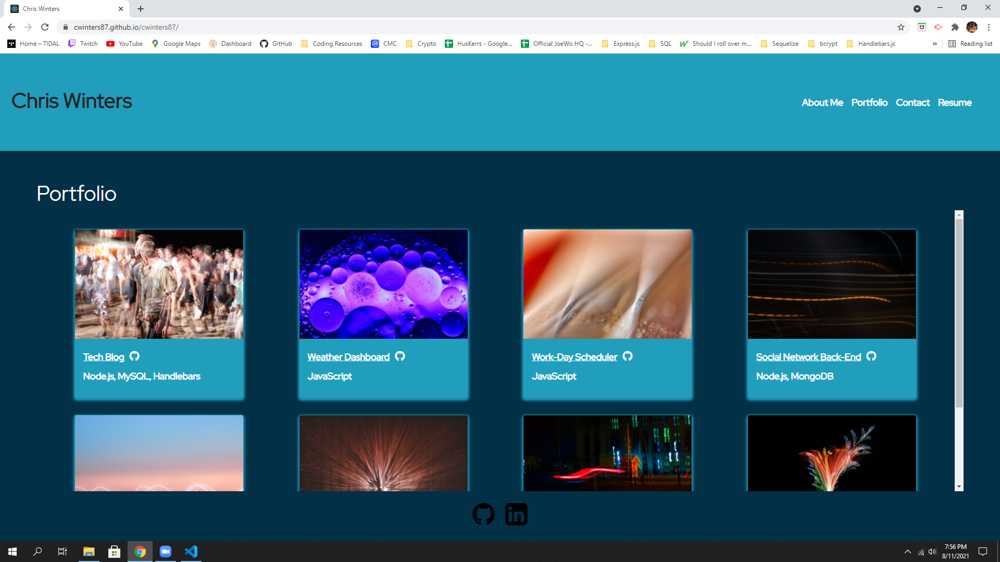

  <h1 align="center">Portfolio</h1>
  
 
## Description
This [Portfolio](https://cwinters87.github.io/cwinters87/) is collection of the many sites and software I've built all rolled up into React website, which I also built.
## Table of Contents
- [Description](#description)
- [Installation](#installation)
- [Usage](#usage)
- [License](#license)
- [Contributing](#contributing)
- [Link](#tests)
- [Questions](#questions)
## Installation
💾 Clone from GitHub, run npm install in the CL, and then npm start.
## Usage
💻 To serve as a user-friendly place to view my projects.
## License
   This application is covered by the MIT license.
## Contributing
👪 Chris Winters
## Link
✏️ Here is a link the [site](https://cwinters87.github.io/cwinters87/).

And he is what the site looks like:

## Questions
🙋‍♂️ Email or reach me on my GitHub  
 
:octocat: Find me on GitHub: [cwinters87](https://github.com/cwinters87) 
 
✉️ Email me with any questions: taylor314@gmail.com  
🌟This README was generated by Chris Winters using the [readme-generator](https://github.com/cwinters87/readme-generator)